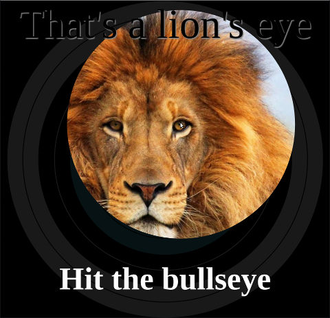

# Instructions

Create a game where the user can rollover or tap on the eye of different animals, to reveal the entire image of the animal.

1. Create a square `<main>` element in the centre of the viewport
2. Use the `target.svg` image as the background
3. Use a `linear-gradient()` to darken the target image
4. Place each of the four animal images in layers that fill the `<main>` element
5. Create a `clip-path: circle(...)` for each of the animal images, so that only one eye is showing.
6. Create a `:hover` rule for each of the images, to make the circle `clip-path` expand to show the entire image.
7. In the HTML file, place a `
` immediately after each of the animal images
8. Use `clip-path: polygon(...)` to create a hole in the `
` that fits the circular `clip-path` around the eye of the animal in the image below.
9. Hide the `
` elements except when the mouse is hovering over the associated animal eye. If you do not do this, your transparent `
` elements will appear between the mouse and the animal images.
10. When the mouse is hovering over a clipped animal image, show the `
` element that is the next sibling of the animal image. (Use the [`+ ` adjacent sibling combinator](https://developer.mozilla.org/en-US/docs/Web/CSS/Adjacent_sibling_combinator).)

Moving the mouse away from an animal's eye should immediately hide the full image.

You'll find information about the position of each animal's eye in the comments in the HTML file.

Click on the image below to see a demo.

